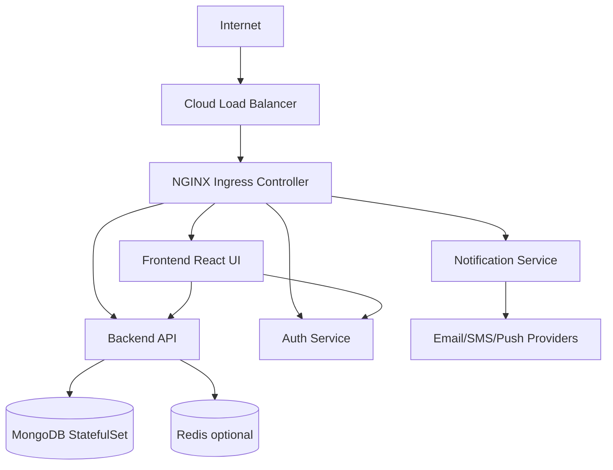

# Production Kubernetes Platform

A production-oriented Kubernetes platform scaffold for four microservices, MongoDB persistence, ingress, TLS, autoscaling, monitoring, logging, security controls, backups, and GitHub Actions deployment.

## Architecture

Traffic enters through a cloud load balancer and NGINX Ingress, then routes to the frontend, backend API, auth service, and notification service. Application workloads use health probes, resource requests and limits, rolling updates, HPA, NetworkPolicy, non-root containers, and Kubernetes Secrets.



## Repository Layout

- `services/`: frontend, backend, auth, and notification applications with Dockerfiles.
- `helm/production-platform/`: Helm chart for workloads, ingress, MongoDB, HPA, secrets, config, and network policies.
- `monitoring/`: Prometheus alert rules and Grafana dashboard JSON.
- `logging/`: Loki and Promtail values.
- `security/`: cert-manager issuer and RBAC examples.
- `backups/`: Velero schedule and MongoDB backup CronJob.
- `docs/`: deployment, scaling, monitoring, and troubleshooting runbooks.
- `scripts/`: local build, install, load test, and validation helpers.

## Quick Start

Prerequisites:

- Kubernetes cluster from Kind, Minikube, EKS, AKS, DigitalOcean Kubernetes, or Oracle Kubernetes Engine.
- `kubectl`, `helm`, Docker, and a working ingress controller.
- Metrics Server for HPA.

Deploy locally:

```bash
./scripts/deploy-local.sh
```

Full local installation guide: [docs/installation-local.md](docs/installation-local.md).

Docker Hub deployment guide for `kmc173/production-platform`: [docs/dockerhub-deployment.md](docs/dockerhub-deployment.md).

GitHub push and CI/CD guide: [docs/github-cicd.md](docs/github-cicd.md).

Render and validate the chart:

```bash
./scripts/validate.sh
```

Run a simple load test:

```bash
./scripts/load-test.sh http://api.example.com/api/products
```

## Production Checklist

- Replace every value under `secrets` with an external secret management flow.
- Set real domains in `helm/production-platform/values.yaml`.
- Install NGINX Ingress, cert-manager, Metrics Server, kube-prometheus-stack, Loki, Promtail, and Velero.
- Configure image registry, image tags, and `KUBE_CONFIG` in GitHub Actions.
- Capture real screenshots under `screenshots/` after the platform is deployed.
